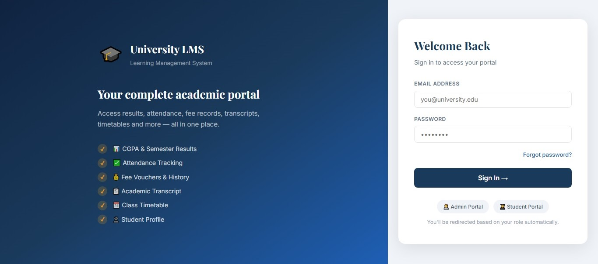
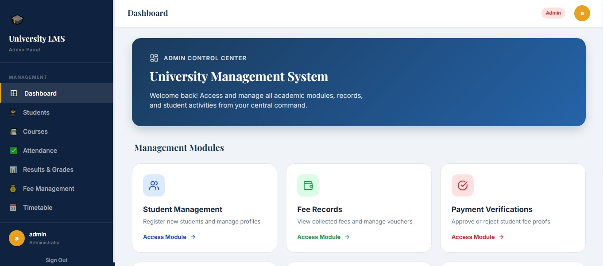
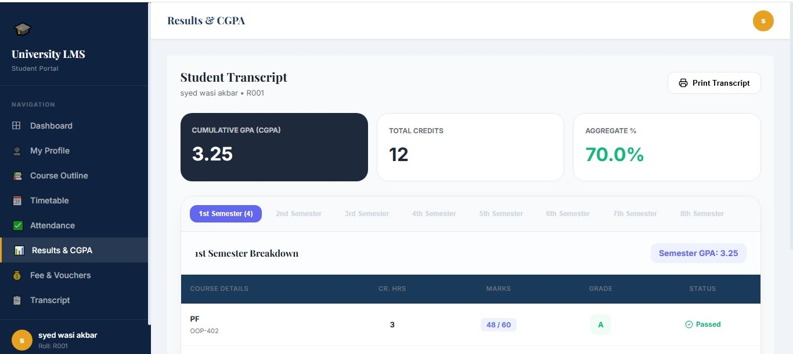

# 🎓 University LMS (Learning Management System)

> A modern, highly intuitive, and comprehensive Learning Management System built for academic institutions to streamline administrative operations and elevate student-faculty interactions.

<div align="center">


### 🌐 [Explore the Live Demo](https://college-lms-728h.vercel.app/)

</div>

---

## 📖 Table of Contents

* [✨ Key Features](#-key-features)
  * [Student Portal](#-student-portal)
  * [Admin Portal](#-admin-portal)
* [🛠️ Tech Stack](#️-tech-stack)
* [📸 App Walkthrough](#-app-walkthrough)
* [📁 Project Architecture](#-project-architecture)
* [🚀 Getting Started](#-getting-started)
* [🔐 Authentication & Security](#-authentication--security)
* [🤝 Contributing](#-contributing)
* [📜 License](#-license)

---

## ✨ Key Features

### ⚙️ Core Functionality
* **Dual-Role Ecosystem:** Dedicated dashboard layouts tailored for Students and Administrators.
* **Role-Based Access Control (RBAC):** Guarded navigation states routing unauthenticated or unauthorized users out of sensitive views.
* **Real-time Syncing:** Powered by Firebase Firestore for instantaneous data synchronization across active clients.
* **Responsive Layouts:** Mobile-first, device-agnostic interface adapting effortlessly to any screen size.

### 👨‍🎓 Student Portal
* **Personalized Dashboard:** Immediate visibility into cumulative GPA, recent announcements, and daily schedule.
* **Course Hub:** View active enrollments alongside structured assignments and lecturer contact profiles.
* **Smart Attendance Tracker:** Color-coded metrics showing individual module attendance percentages against requirements.
* **Financial Terminal:** Transparent invoicing, payment history logging, and active late-fee calculators.

### 👨‍💼 Admin Portal
* **System Analytics:** High-level operational overview including total active students, course distributions, and financial metrics.
* **Academic Provisioning:** Intuitive CRUD portals to easily manage student directories, assign module lecturers, and manage grade distribution.
* **Scheduler Engine:** Interactive conflicts-free timetable allocator tool.

---

## 🛠️ Tech Stack

| Layer | Component | Description |
| :--- | :--- | :--- |
| **Frontend Core** | `React 18+` | Declarative UI structure utilizing functional component hooks |
| **Build Engine** | `Vite` | Next-gen hot module replacement (HMR) & rapid bundler tooling |
| **Routing Manager** | `React Router v6` | Declarative client-side routing hierarchy with protected layout wrappers |
| **Backend / DB** | `Firebase Firestore` | Real-time scalable NoSQL document database cloud architecture |
| **Identity Service**| `Firebase Auth` | Secure persistent token-based user authentication engine |
| **Design / Icons** | `CSS3` & `Lucide React` | High-fidelity fluid design patterns with minimalist iconography |

---

## 📸 App Walkthrough

### 🔒 Gateway Authentication
<div align="center">
  
  <p><i>Figure 1: Portal authentication interface featuring dynamic role detection.</i></p>
</div>

### 📊 Operations Dashboard
<div align="center">
  
  <p><i>Figure 2: Real-time telemetry feed displaying core system performance indicators.</i></p>
</div>

### 🛠️ Configuration Portal
<div align="center">
  
  <p><i>Figure 3: Multi-tier administration configuration interface.</i></p>
</div>

---

## 📁 Project Architecture

```text
college-lms/
├── src/
│   ├── assets/              # Static media files, high-res images, and logos
│   ├── components/          # Globally shared Atomic UI elements (Buttons, Inputs, Cards)
│   ├── pages/               # Stateful view components mapped to active routes
│   │   ├── Student/         # Dedicated views context for Student workflows
│   │   └── Admin/           # Dedicated views context for Administration workflows
│   ├── utils/               # Shared business logic and helper functions
│   ├── styles/              # Global stylesheets & design-system rule sheets
│   ├── firebase/            # Initialization configs and Firestore CRUD service models
│   ├── App.jsx              # Application root entry point with router mappings
│   └── main.jsx             # DOM mounting engine
├── public/                  # App manifest configurations and public web assets
├── package.json             # Engine dependency declarations
└── vite.config.js           # Core compiler and runtime configs
